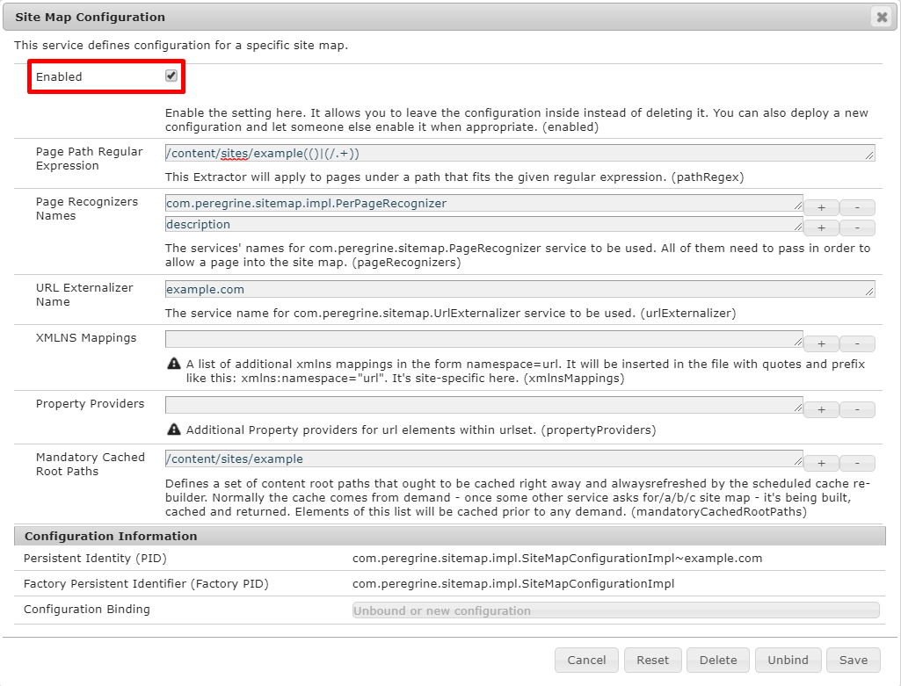

peregrine cms site maps
=====

# Introduction

Peregrine supports an extensive `sitemap.xml` rendition and caching mechanism. It supports cache rebuilds triggered by
resource changes and time-based via a cron-like expression. It's easily configurable and highly customizable by plugins. 

## Example
The default installation contains
an example configuration for the site map of [/content/sites/example](http://localhost:8080/content/sites/example.html).
It's disabled by default though. One needs to enable it inside the appropriate
[com.peregrine.sitemap.impl.SiteMapConfigurationImpl](http://localhost:4502/system/console/configMgr/com.peregrine.sitemap.impl.SiteMapConfigurationImpl~example.com)
configuration:

It will be then available under [/content/sites/example.sitemap.xml](http://localhost:8080/content/sites/example.sitemap.xml).
The cached file will reside under [/var/sitemaps/files/content/sites/example](http://localhost:8080/bin/browser.html/var/sitemaps/files/content/sites/example)
and the backing structure - under [/var/sitemaps/structure/content/sites/example/jcr:content](http://localhost:8080/bin/browser.html/var/sitemaps/structure/content/sites/example/jcr%3Acontent).

